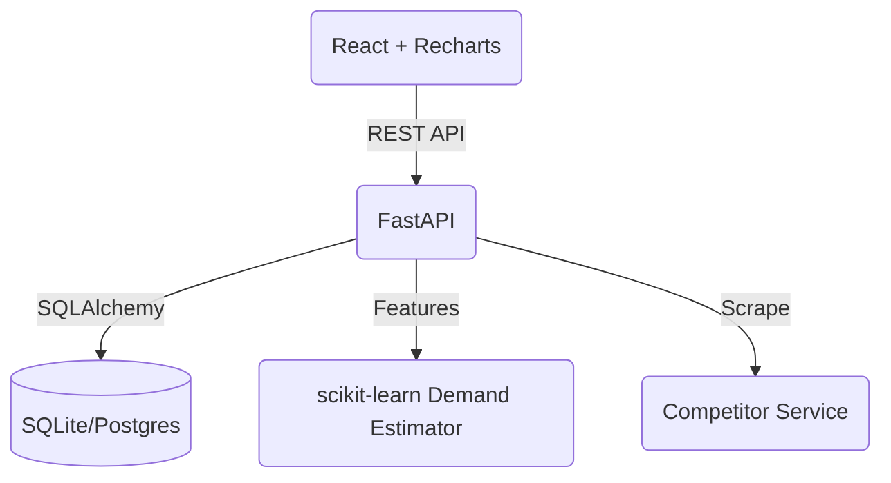

# Dynamic Pricing Engine 🚀


A production-quality AI-powered Dynamic Pricing Engine built with FastAPI, React, and scikit-learn.

## 🎯 The Problem
Companies like Amazon change prices **2.5 million times a day** to stay competitive. Manual pricing is impossible at scale.

## ✨ Features
- 🧠 **AI Demand Estimation**: Uses `GradientBoostingRegressor` to predict demand based on price, seasonality, and stock.
- ⚖️ **Smart Pricing Rules**: Automatically adjusts prices using competitor data while respecting cost floors and MSRP ceilings.
- 🕵️ **Competitor Simulation**: Scrapes and tracks competitor pricing in real-time (simulated).
- 📊 **Real-time Dashboard**: Track revenue impact, average price changes, and products needing review.

## 🏗️ Architecture


## 🚀 Quick Start
```bash
# Clone the repository
# Build and run with Docker
docker-compose up --build
```
- **Frontend**: http://localhost:3000
- **API Docs**: http://localhost:8000/docs

## 📚 API Endpoints
| Method | Endpoint | Description |
|---|---|---|
| `GET` | `/products/` | List all products |
| `GET` | `/pricing/{id}/recommend` | Get AI price recommendation |
| `POST`| `/pricing/{id}/apply` | Apply new recommended price |
| `POST`| `/competitors/update` | Refresh competitor prices |

## ⚙️ Pricing Algorithm
The system calculates optimal prices by:
1. Fetching competitor averages.
2. Predicting demand elasticity using ML.
3. Applying business constraints (e.g. `price >= cost * 1.1`).

## 🛠️ Tech Stack
| Tier | Technology |
|---|---|
| Backend | Python, FastAPI, SQLAlchemy, Pydantic |
| Frontend | React, Vite, Recharts, Lucide-React |
| Machine Learning | scikit-learn, pandas, numpy |
| Infrastructure | Docker, GitHub Actions CI |

## 📄 License
MIT License
