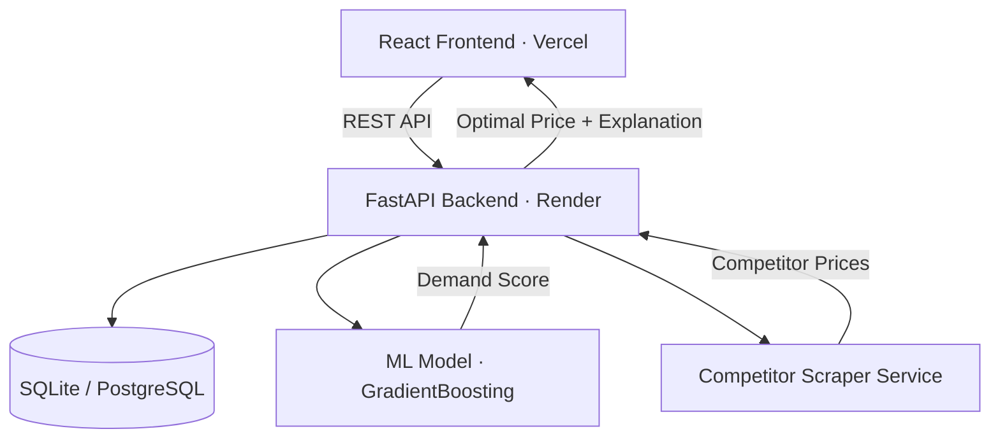
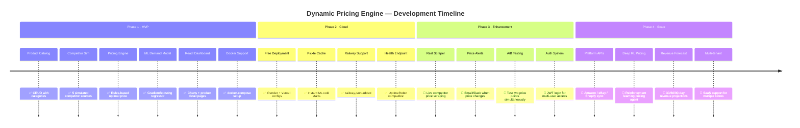

# 💰 Dynamic Pricing Engine

[](https://www.python.org/)
[](https://fastapi.tiangolo.com/)
[](https://reactjs.org/)
[](https://www.docker.com/)
[](https://render.com)
[](https://vercel.com)
[](https://opensource.org/licenses/MIT)

> **Did you know?** Amazon changes its prices **~2.5 million times per day**. Small and mid-size retailers can't compete manually. This project levels the playing field.

An ML-powered dynamic pricing system that **tracks competitor prices**, **estimates demand**, and **automatically recommends optimal product prices** with margin guardrails — all via a clean React dashboard.

---

## ✨ Features

- 💹 **Demand-Driven Pricing** — GradientBoosting ML model estimates demand at any price point
- 🕵️ **Competitor Price Tracking** — Simulated real-time scraper with 5 competitor sources
- 🛡️ **Margin Guardrails** — Prices never go below `cost × 1.1` or above `MSRP × 1.2`
- 📈 **Price History Charts** — 30-day interactive price trend per product
- 🏷️ **One-Click Apply** — Review recommendation and apply in one click
- 🐳 **Fully Dockerized** — One-command local startup
- ☁️ **Cloud Ready** — Deploy to Render + Vercel in minutes

---

## 🏗️ Architecture



---

## 💡 Pricing Algorithm

```
optimal_price = competitor_avg × 0.95          # undercut by 5%
optimal_price = max(optimal_price, cost × 1.1) # margin floor
optimal_price = min(optimal_price, msrp × 1.2) # ceiling cap

if demand_score > 0.7:
    optimal_price *= 1.05  # high demand → premium pricing
```

---

## 🚀 Deploy Online for Free

### Step 1 — Backend on Render

1. Go to **[render.com](https://render.com)** → **New Web Service**
2. Connect GitHub repo: `dynamic-pricing-engine`
3. Settings:
   | Field | Value |
   |-------|-------|
   | Root Directory | `backend` |
   | Build Command | `pip install -r requirements.txt` |
   | Start Command | `uvicorn app.main:app --host 0.0.0.0 --port $PORT` |
   | Environment | Python 3 |
4. Add **Environment Variables** in the Render dashboard:
   ```
   CORS_ORIGINS = https://your-app.vercel.app
   ```
5. Click **Deploy** → note your Render URL

### Step 2 — Frontend on Vercel

1. Go to **[vercel.com](https://vercel.com)** → **New Project** → import this repo
2. Settings:
   | Field | Value |
   |-------|-------|
   | Root Directory | `frontend` |
   | Framework | Vite |
3. Add **Environment Variable**:
   ```
   VITE_API_URL = https://dynamic-pricing-engine-api.onrender.com
   ```
4. Click **Deploy** → your app is live! 🎉

> [!NOTE]
> Render's free tier **sleeps after 15 min of inactivity**. The first request may take ~30s. This is normal for free-tier portfolio projects.

---

## 🐳 Run Locally with Docker

```bash
git clone https://github.com/siddhantm29-netizen/dynamic-pricing-engine
cd dynamic-pricing-engine
docker-compose up --build
```

| Service | URL |
|---------|-----|
| Frontend | http://localhost:3000 |
| API Docs | http://localhost:8000/docs |

---

## 🛠️ Manual Local Setup

**Backend:**
```bash
cd backend
python -m venv venv && source venv/bin/activate
pip install -r requirements.txt
uvicorn app.main:app --reload
```

**Frontend:**
```bash
cd frontend
npm install
npm run dev
```

---

## 📡 API Reference

| Method | Endpoint | Description |
|--------|----------|-------------|
| `GET`  | `/products/` | List all products |
| `GET`  | `/products/{id}` | Get product details |
| `GET`  | `/products/{id}/price-history` | 30-day price history |
| `GET`  | `/pricing/{id}/recommend` | Get pricing recommendation |
| `POST` | `/pricing/{id}/apply` | Apply recommended price |
| `GET`  | `/pricing/dashboard/stats` | Dashboard statistics |
| `GET`  | `/competitors/{id}` | Competitor prices for product |
| `POST` | `/competitors/update` | Simulate competitor price refresh |

Full interactive docs at `/docs` (Swagger UI).

---

## 🧠 ML Model

**Algorithm:** `GradientBoostingRegressor` (scikit-learn)  
**Training data:** 1,000 synthetic demand records generated on startup

| Feature | Description |
|---------|-------------|
| `price` | Current product price |
| `day_of_week` | Day 0–6 (weekends drive higher demand) |
| `month` | Month 1–12 (seasonality) |
| `competitor_avg_price` | Average of all competitor prices |
| `stock_level` | Current inventory count |
| `is_weekend` | Boolean flag |

**Output:** Estimated units sold at the given price point, used to determine demand tier.

---

## 💻 Tech Stack

| Layer | Technology |
|-------|-----------|
| Frontend | React 18, Vite, React Router, Recharts, Lucide Icons |
| Backend | Python 3.11, FastAPI, SQLAlchemy, Pydantic v2 |
| ML | scikit-learn (GradientBoosting), Pandas, NumPy |
| Database | SQLite (dev) / PostgreSQL (prod via `DATABASE_URL`) |
| DevOps | Docker, docker-compose, GitHub Actions CI/CD |
| Hosting | Render.com (backend) + Vercel (frontend) |

---

## 📦 Seeded Demo Data

15 products across 4 categories with realistic pricing:

| Category | Examples |
|----------|---------|
| Electronics | iPhone 15 Pro, Samsung 4K TV, MacBook Air |
| Clothing | Nike Air Max, Levi's Jeans |
| Books | Clean Code, System Design Interview |
| Appliances | Dyson V15, Ninja Air Fryer |

Each product has 30 days of simulated price history and 5 competitor price records.

---

## 🗺️ Roadmap

> Track progress via [GitHub Issues](https://github.com/siddhantm29-netizen/dynamic-pricing-engine/issues) and [Project Board](https://github.com/siddhantm29-netizen/dynamic-pricing-engine/projects).



### ✅ Phase 1 — MVP *(Completed)*

- [x] Product catalog management (CRUD)
- [x] Simulated competitor price scraper (5 sources)
- [x] Core pricing rules engine with margin guardrails
- [x] GradientBoosting ML demand estimation model
- [x] 30-day price history tracking per product
- [x] React + Vite dashboard with interactive Recharts
- [x] Product detail page with price trend chart
- [x] Competitor price comparison table
- [x] SQLite database with 15 seeded products
- [x] Docker + docker-compose one-command startup
- [x] GitHub Actions CI/CD pipeline

### ✅ Phase 2 — Cloud Deployment *(Completed)*

- [x] Render.com backend deployment (`render.yaml`)
- [x] Vercel frontend deployment (`vercel.json`)
- [x] Railway.app support (`railway.json`)
- [x] ML model pickle cache — cold start < 1s
- [x] `/health` endpoint for UptimeRobot keep-alive
- [x] Environment variable config (CORS, DATABASE_URL)
- [x] PostgreSQL support via `DATABASE_URL`

### 🔲 Phase 3 — Feature Enhancement *(Planned)*

- [ ] **Live competitor scraping** — Playwright/Scrapy scraper for real retailer sites (Amazon, Flipkart)
- [ ] **Price change alerts** — Email (SendGrid) and Slack webhook notifications when optimal price shifts >5%
- [ ] **A/B price testing** — Split traffic between two price points and measure conversion
- [ ] **JWT authentication** — Secure login for store managers with role-based permissions
- [ ] **Bulk product import** — CSV upload for onboarding large catalogues
- [ ] **Price approval workflow** — Require manager approval before high-impact price changes apply
- [ ] **Dark mode** — Dashboard theme toggle
- [ ] **Unit test coverage** — Expand from 3 → 80%+ coverage

### 🔲 Phase 4 — Production Scale *(Future)*

- [ ] **Amazon Selling Partner API** — Pull real competitor prices and sync your listings automatically
- [ ] **Shopify / WooCommerce integration** — Apply recommended prices directly to your storefront via API
- [ ] **Reinforcement Learning pricing agent** — Replace rule-based engine with a Deep Q-Network that learns from actual sales outcomes
- [ ] **Real demand data** — Train on actual transaction history instead of synthetic data
- [ ] **Revenue forecasting** — 30/60/90-day forward revenue projections using Prophet
- [ ] **Elasticity modelling** — Calculate true price elasticity per SKU from historical data
- [ ] **Multi-currency support** — Geo-based pricing for international markets
- [ ] **Multi-tenant SaaS** — Onboard multiple independent stores under one deployment

---

## 🤝 Contributing

Pull requests are welcome! Open an issue first for major changes.

## 📄 License

[MIT](https://opensource.org/licenses/MIT)
